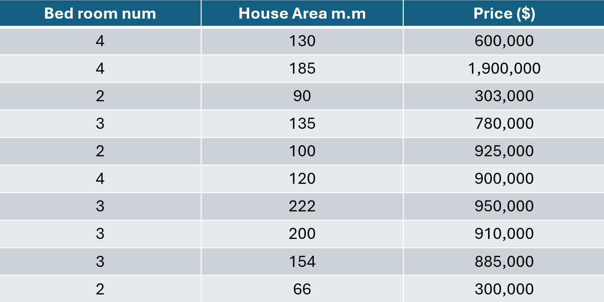
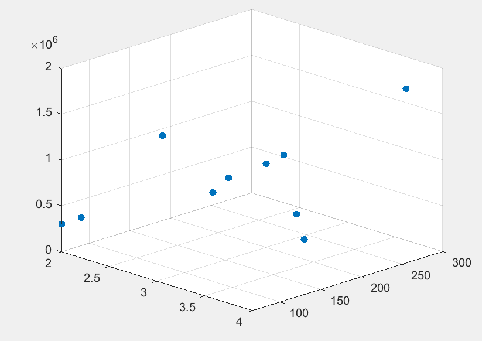
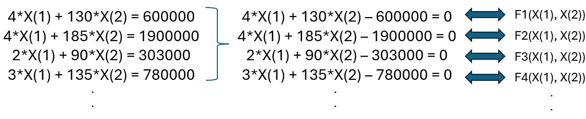
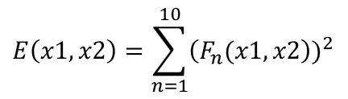
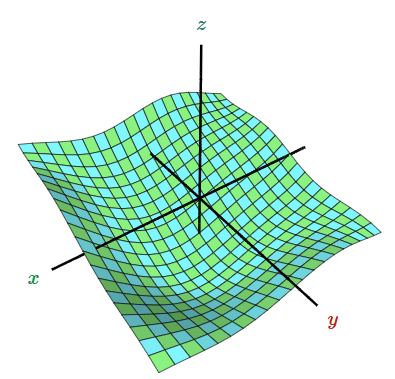
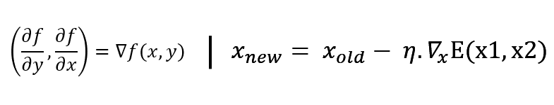

# 📊 Linear Regression from Scratch with Least Squares & Gradient Descent

Welcome to this educational project that demonstrates how to solve a **linear regression** problem using pure **Python** and **NumPy** with no machine learning libraries. The solution is built from scratch based on core mathematical concepts like:

- 🔢 **Least Squares Error**
- 🔁 **Gradient Descent Algorithm**

---
## 🏡 Boston home price prediction

I gathered some data about the Boston home prices, rooms, and area.<br>
This model cannot be very accurate in predicting house prices because it is a simple scratch model and advanced machine learning libraries
were not used to build the model.<br>The focus of this project is on the basic concepts of linear regression.

---
### 📁 Dataset

Data represented in the table and visualized by using MATLAB
<p>
    
    
<p/>
    
---

# 📖 Step by step with math

## Least squares problem

First, we write the equations in a form that allows us to construct the loss function.<br>
And according to the following formula, we get the error function.<br><br>



## Gradient descent
Now we have the function E, we need to find the minimum value of this function with the help of optimization algorithms.<br>
Here I used the gradient descent algorithm.<br><br>
<p>
    
    
<p/><br>
Here, n represents the learning rate. A high learning rate increases the fluctuations and changes in X_new, and on the other hand a low value slows down the speed of finding the minimum of the function.

---

## 🧑‍💻 Now start coding
## 
```python
# write our data as a matris

equations = [
    [4, 130, 600000],
    [4, 185, 1900000],
    [2, 90, 303000],
    [3, 135, 780000],
    [2, 100, 925000],
    [4, 120, 900000],
    [3, 222, 950000],
    [3, 200, 910000],
    [3, 154, 885000],
    [2, 66, 300000]
]

# Convert to NumPy arrays
A = np.array([[e[0], e[1]] for e in equations], dtype=float)   # x1 x2
b = np.array([e[2] for e in equations], dtype=float)           # z
```

---

## 📉 Loss Function: Least Squares
We use the **sum of squared errors** as the loss function:

```python
def compute_loss(A, b, z):
    error = A @ z - b
    return np.sum(error**2)
```

---

## 🔍 Gradient Calculation
We manually calculate the gradient of the loss function to update our parameters:

```python
def compute_gradient(A, b, z):
    error = A @ z - b
    return 2 * A.T @ error
```

---

## ⚙️ Gradient Descent Algorithm
We apply gradient descent to iteratively minimize the loss:

```python
# start with random values for x and y
z = np.random.rand(2, 1) * 2 - 1 # Initialize x and y between -1 and 1 (smaller initial range)

# hyperparameters for gradient descent
learning_rate = 0.000001
num_iterations = 200000

loss_history = []

print(f"Initial x1: {z[0,0]:.4f}, Initial x2: {z[1,0]:.4f}")
print(f"Initial Loss: {compute_loss(A, b, z):.4f}")
print("-" * 30)

# gradient Descent Loop
for i in range(num_iterations):
    # calculate the gradient
    grad = compute_gradient(A, b, z)

    z = z - learning_rate * grad

    # compute and store the current loss
    current_loss = compute_loss(A, b, z)
    loss_history.append(current_loss)

    if (i + 1) % 5000 == 0:
        print(f"Iteration {i+1}: Loss = {current_loss:.4f}, x = {z[0,0]:.4f}, y = {z[1,0]:.4f}")

print("-" * 30)
print(f"Optimal x1 found: {z[0,0]:.4f}")
print(f"Optimal x2 found: {z[1,0]:.4f}")
print(f"Final Loss: {loss_history[-1]:.4f}")
```

---

## ✅ Output
After training, we got x1 and x2 that there are the slopes of a line in Three-dimensional space.<br>
that num_of_rooms * x1 + area * x2 = home price prediction

---

## 📚 Concepts Covered
- 📐 Linear regression modeling concepts
- 🔢 Loss function (Least Squares)
- 📏 Manual gradient computation
- 🔁 Gradient Descent Optimization

---

## 📦 Requirements
- Python 3.x 🐍
- NumPy 🔢

---

> 💡 **Tip:** This project is great for learning linear regression internals, understanding how gradient descent works, and seeing how core math applies to real problems.

Made with ❤️ by [Yousef Yousefian]
